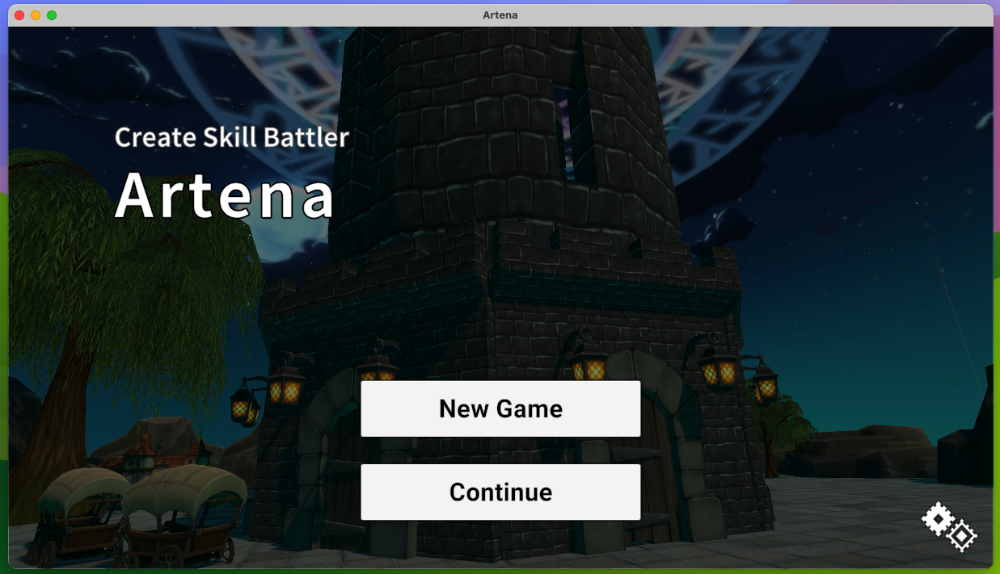
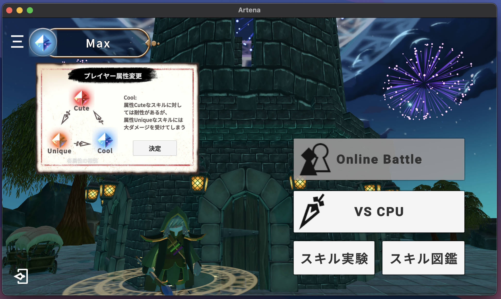
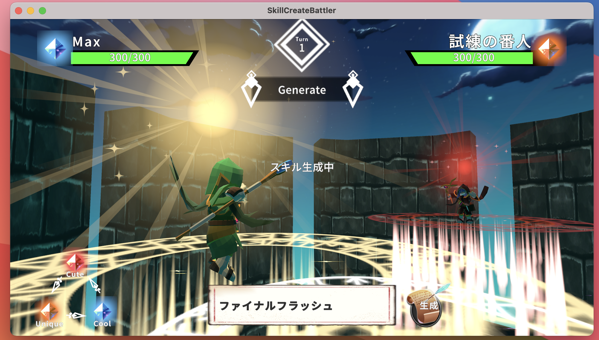
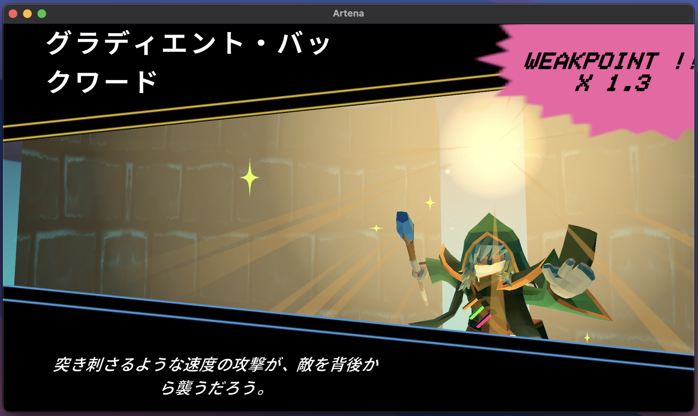
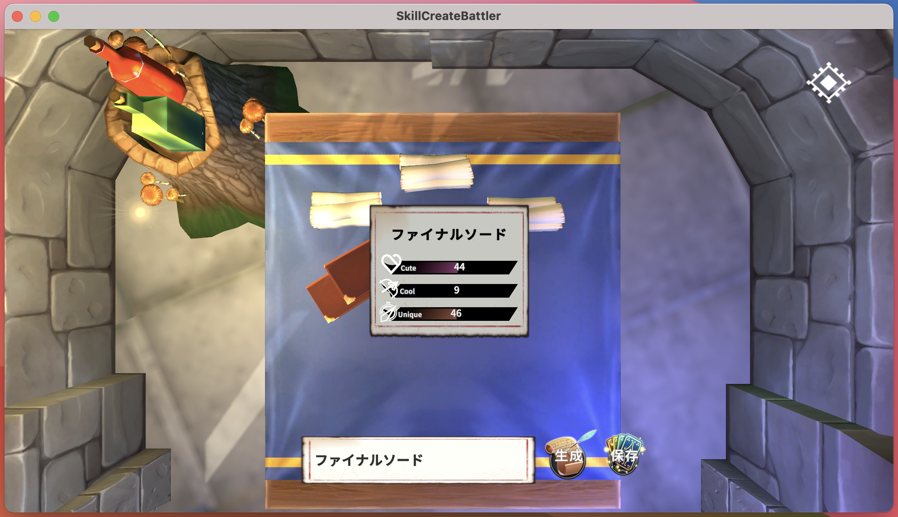
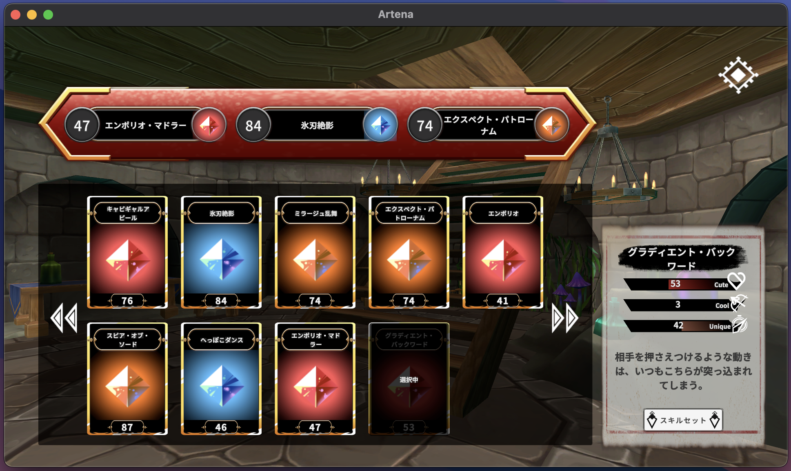

# Artena

## 開発動機
* AIだからこそできる面白いゲームを模索するため、開発した。
* 「子供の頃面白かったこと、楽しんでいたこと」を考えた結果、ごっこ遊びがあった。そこで、自分で必殺技やスキル名を考えてバトルできるゲームがあれば、小さい頃の夢が叶うと思い制作を始めた。

## プレイ動画と実行ファイル
プレイ動画: (画像をクリックするとYouTubeが開きます。)

<!-- https://youtu.be/L0d9tQNQaoc -->

実行ファイル:
https://drive.google.com/drive/folders/14F7SCx6YtF4YProhgeOBANY0SIQtWpw6?usp=sharing

(おすすめはApple Silicon Mac(M1, M2, M3などのSoCを搭載したMac)。もっとも動作がスムーズです。Windowsでも動きますが、スペックによってはゲームプレイに支障をきたす可能性があります。)

## ゲームの概要
各ターンに1回、スキル名を考え、生成させ、それを使いバトルを行います。
キャラクターとスキルには属性が付与されており、属性同士の相性によってダメージが増えたり、減ったりします。

### 属性について
スキルとプレイヤーには、3つの属性があります。
スキルには、Cute, Cool, Uniqueの3つのパラメータがあり、そのうち最大の数値を持つパラメータがそのスキルの属性となります。

プレイヤーは自身の好きな属性をメインメニューで選択することができます。
相手のからうけるダメージは相手が生成したスキルの属性と自身の属性の相性によって決まります。

### VS CPU
CPUとの対戦が行えます。

相手の属性の弱点となるスキルの生成を目指そう

### スキル実験
バトル場面以外でスキル生成の実験を行うことができ、気に入ったものは保存することができます。

### スキル図鑑
スキル実験で保存したスキルを閲覧することができます。

また、バトル時に使用する「スキルセット」を更新することができます。

スキルセットにセットしたスキルを参考に、入力したスキルのパラメータが生成されていきます。
自分好みのスキルパラメータを生成させるためには、スキルセットを極めてください。

<!-- ## プレイ動画
ゲームプレイ映像は以下のURLから確認できます。

https://youtu.be/L0d9tQNQaoc

## 実行ファイル
以下のURLからMacOS版とWindowsOS版をダウンロードすることができます。
ダウンロードしてうまく起動できない場合は`Artena実行ファイルについて.pdf`を参照してください。

MacOS版は、Apple Silicon, Intel両方動くようにビルドしていますが、Intel Macでの動作確認はしておりません。

Windows版でも動作確認できておりますが、CPUの性能によってはAIを動作させるのに時間がかかってしまう場合があります。

Apple Silicon Macでは問題なく動作します。

https://drive.google.com/drive/folders/14F7SCx6YtF4YProhgeOBANY0SIQtWpw6?usp=sharing -->

## ゲームのこだわり
### 任意のスキル名からスキルを生成可能
このゲームの最大のこだわりは、プレイヤーが考えた**かっこいいスキル名** や、**かわいいスキル名** を使用して戦うことができるゲームだということです。
任意のスキル名でスキルを生成できるようにするため、ゲームのランタイムで、**大規模言語モデル(LLM)** を動かして、スキル名の特徴を把握させ、スキルの強さを決定させています。

### カメラワークによる演出
ゲームのワクワクする要素として、カメラワークによる演出にゲームの臨場感が感じられた経験から、カメラワークをこだわりました。特に、生成させたスキルが会心を出したり、相手の属性の弱点を出した時は、カットイン演出でワクワクさせる表現をしてみました。

