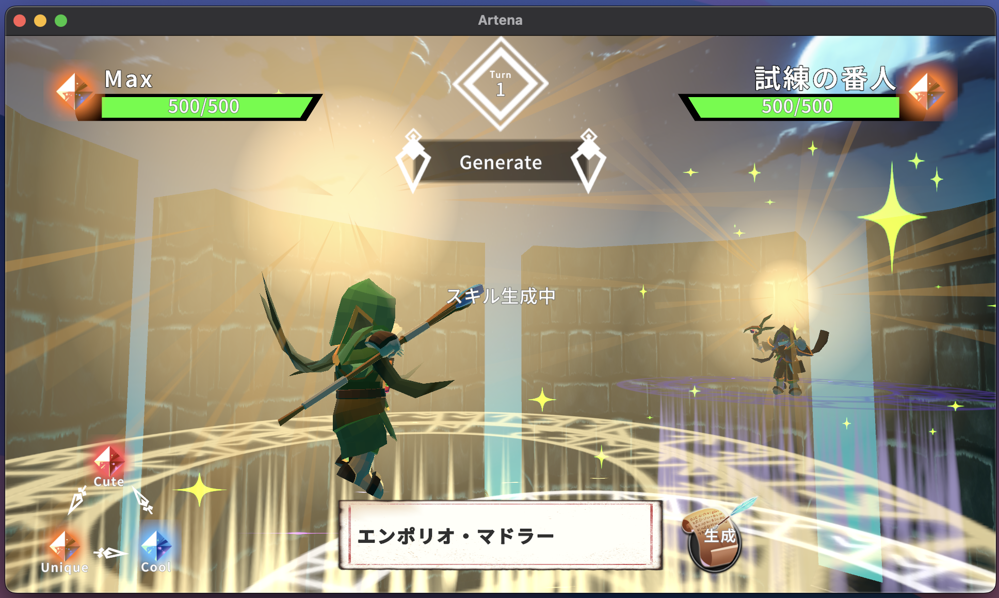
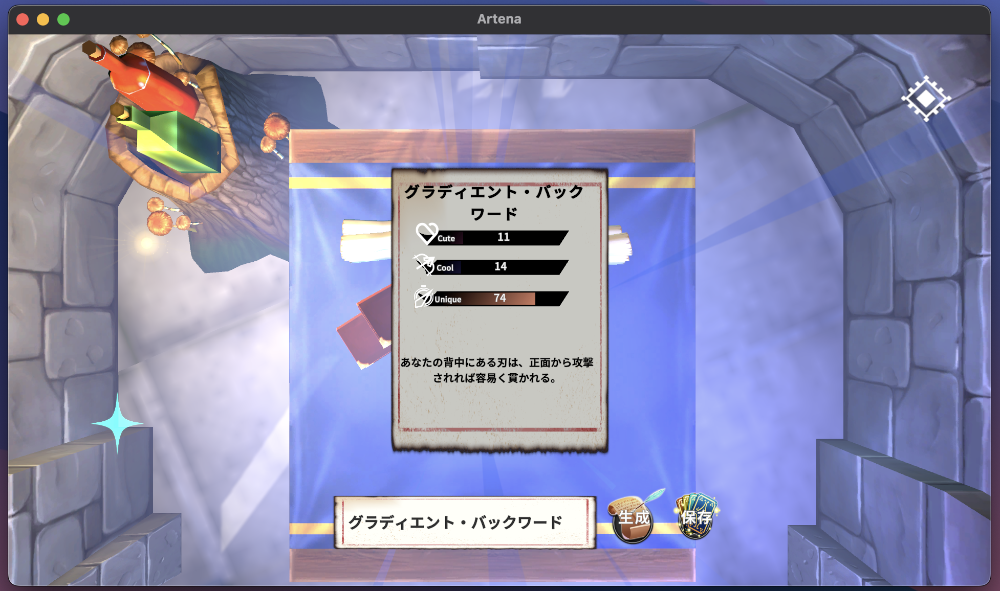

# Artena

## 開発動機
AIだからこそできる面白いゲームを模索するため、開発した。

「子供の頃面白かったこと、楽しんでいたこと」を考えた結果、ごっこ遊びがあった。
そこで、自分で必殺技やスキル名を考えてバトルできるゲームがあれば、小さい頃の夢が叶うと思い制作を始めた。

## ゲームの概要
各ターンに1回、スキル名を考え、生成させ、それを使いバトルを行います。
キャラクターとスキルには属性が付与されており、属性同士の相性によってダメージが増えたり、減ったりします。
### スキルの属性について
生成されるスキルにはCute, Cool, Uniqueの3つのパラメータで生成されますが、そのうち最大の数値を持つパラメータがそのスキルの属性となります。

### VS CPU
CPUとの対戦が行えます。

<!--  -->

<!--  -->

### スキル実験
バトル場面以外でスキル生成の実験を行うことができ、気に入ったものは保存することができます。

### スキル図鑑
スキル実験で保存したスキルを閲覧することができます。

また、バトル時に使用する「スキルセット」を更新することができます。

スキルセットにセットしたスキルを参考に、入力したスキルのパラメータが生成されていきます。
自分好みのスキルパラメータを生成させるためには、スキルセットを極めてください。

## プレイ動画
https://youtu.be/I5KTwviAado

## 実行ファイル
以下のURLからMacOS版とWindowsOS版をダウンロードすることができます。
ダウンロードしてうまく起動できない場合は`Artena実行ファイルについて.pdf`を参照してください。
https://drive.google.com/drive/folders/14F7SCx6YtF4YProhgeOBANY0SIQtWpw6?usp=sharing

